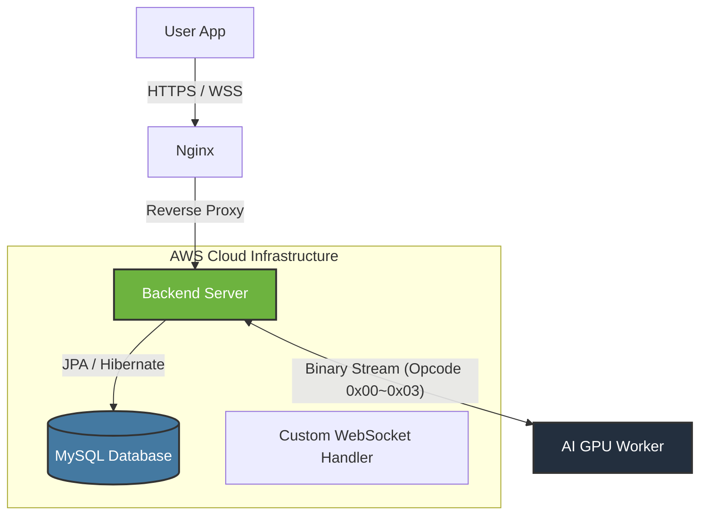

#  Anycall Backend Server
### AI-Powered Voice Calling Service for Seniors

 

 

> **"그리운 목소리와 다시 한번."**
>  
> **Anycall**은 디지털 소외 계층인 시니어를 위해 가장 익숙한 인터페이스인 '전화'를 통해 AI와 소통할 수 있도록 돕는 서비스입니다.
>  본 프로젝트는 서비스의 핵심인 **실시간 음성/텍스트 데이터 중계** 및 **대규모 사용자 세션 관리**를 담당하는 백엔드 서버입니다.

 

---

## Table of Contents
1. [Architecture](#architecture)
2. [Key Challenges & Solutions](#key-challenges--solutions)
3. [Tech Stack](#tech-stack)
4. [Protocol Specification](#protocol-specification)
5. [Database Schema](#database-schema)
6. [Infrastructure & Security](#infrastructure--security)
7. [Testing & Simulation](#testing--simulation)

 

##  Architecture

**Anycall Backend**는 MSA(Microservices Architecture) 환경에서 프론트엔드와 AI GPU 워커 사이의 **Hub** 역할을 수행하며, **초저지연(Ultra-low Latency)** 통신을 보장합니다.

##  Key Challenges & Solutions

개발 과정에서 직면한 주요 기술적 난제와 해결 전략입니다.

### 1. 실시간성을 위한 WebSocket 최적화
> **Problem**
> * 기존 HTTP/REST 방식은 실시간성이 떨어지며, STOMP 프로토콜은 헤더 오버헤드가 커서 오디오 스트리밍 시 지연이 발생함.

> **Solution**
> * **Raw WebSocket Handler**를 직접 구현하여 프로토콜 오버헤드를 최소화.
> * 텍스트와 오디오 데이터를 단일 채널에서 효율적으로 처리하기 위해 **Custom Binary Protocol** 설계 및 적용.

### 2. User-Worker 동적 매핑 (Dynamic Mapping)
> **Problem**
> * 다수의 사용자가 동시에 통화를 시도할 때, 한정된 고비용 자원인 GPU 워커를 효율적으로 배분해야 함.

> **Solution**
> * 서버 메모리 내 `ConcurrentHashMap`을 활용한 **User Pool** 및 **GPU Pool** 구축으로 Thread-safe 보장.
> * 통화 요청 시 유휴(Idle) 상태의 워커를 즉시 탐색하여 **1:1 세션 매핑(Pairing)** 후 비동기 데이터 중계 처리.

 

---

##  Tech Stack

| Category | Technology | Description |
| :--- | :--- | :--- |
| **Framework** |  | Core Backend Framework |
| **Language** |  | Main Language |
| **Database** |  | AWS RDS (Persistence) |
| **Network** |  | Low-latency Streaming |
| **Infrastructure** |  | Cloud Hosting |
| **CI/CD** |  | Automated Deployment Pipeline |

 

---

##  Protocol Specification

패킷의 첫 1바이트(Header)를 **Opcode**로 사용하여 데이터 유형을 식별합니다.

| Opcode (Hex) | Data Type | Direction | Description |
| :---: | :--- | :---: | :--- |
| `0x00` | **Audio Chunk** | Bi-directional | 실시간 음성 PCM 데이터 스트림 |
| `0x01` | **User Text** | GPU $\rightarrow$ User | STT (Speech-to-Text) 변환 텍스트 |
| `0x02` | **AI Text** | GPU $\rightarrow$ User | LLM 생성 응답 텍스트 |
| `0x03` | **Control Signal** | GPU $\rightarrow$ User | Zero-shot 학습 완료 등 시스템 제어 신호 |

 

---

##  Database Schema

데이터 무결성과 보안을 최우선으로 고려하여 정규화된 스키마를 설계했습니다.

* **`Users`**: 사용자 인증 및 기본 정보 관리
* **`Voice_Profile`**: Voice Cloning을 위한 가족 목소리 데이터 (BLOB) 및 메타데이터
* **`Call_Session`**: 통화 시작/종료 시간 및 매핑된 프로필 정보
* **`Message`**: 통화 중 발생한 대화 로그 저장 (Timestamp 포함)

>  **Security Note**: AWS RDS는 외부 접근이 차단된 Private Network에 배치되었으며, 오직 **Bastion Host**를 통한 SSH Tunneling으로만 접근 가능합니다.

 

---

##  Infrastructure & Security

**GitHub Actions**를 활용한 완전 자동화된 배포 파이프라인을 구축했습니다.

1.  **Code Push**: `main` 브랜치 업데이트 시 트리거
2.  **Build & Test**: Gradle 빌드 및 JUnit 테스트 자동 수행
3.  **Dockerize**: Docker 이미지 빌드 및 Docker Hub 푸시
4.  **Deploy**: AWS EC2에서 최신 이미지 Pull & Run (Blue/Green 배포 지향)
5.  **SSL/TLS**: Let's Encrypt 인증서를 통한 **HTTPS/WSS** 보안 연결 강제

 

---

##  Testing & Simulation

모바일 클라이언트나 AI 모델 없이도 서버 로직을 검증할 수 있는 **자체 시뮬레이터**를 개발하여 테스트를 수행했습니다.

* **Unit Test**: `JUnit 5` & `Mockito` 기반 비즈니스 로직 검증
* **Load Simulation**: HTML/JS 기반의 가상 클라이언트 및 워커 시뮬레이터

  
  
  
<i>Left: User Client Simulator / Right: GPU Worker Simulator</i>

 
